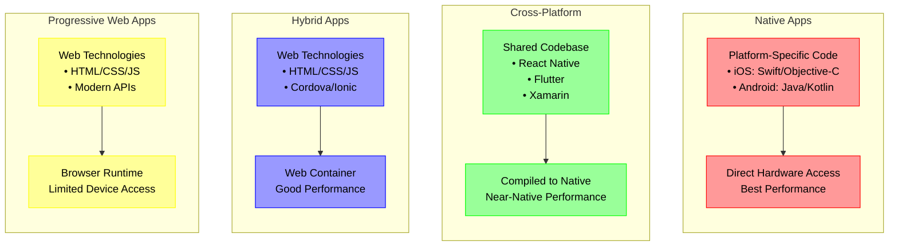

# Piscine Mobile

## Mobile

- [AWS - Mobile App Dev](https://aws.amazon.com/mobile/mobile-application-development/)
- [IBM - Mobile App Dev](https://www.ibm.com/think/topics/mobile-application-development)

There are 4 main ways to develop mobile applications:



Breakdown of Each Approach:

- Native Applications
  - Written specifically for each platform
  - Best performance and direct hardware access
  - Requires separate codebases for iOS and Android
  - Higher initial investment but optimal results
- Cross-Platform Development
  - Single codebase for multiple platforms
  - Popular frameworks include Flutter and Xamarin
  - Better resource utilization compared to hybrid apps
  - Ideal for complex applications needing native performance
- Hybrid Applications
  - Built using web technologies (HTML/CSS/JavaScript)
  - Runs in a web container with native bridge
  - Easier to maintain but may have performance limitations
  - Good for simpler applications or web-first experiences
- Progressive Web Apps (PWAs)
  - Web applications with app-like features
  - No installation required
  - Works across devices through browsers
  - Limited access to device hardware

### Mobile Development Environment

#### Front-end Components

- Visual and interactive parts users experience directly
- Resides on the device or accessible through browser
- Focuses on user interface and experience

#### Back-end Services

- Handles data processing and storage
- Manages API connections
- Provides cloud services integration

### Key Considerations for Mobile Development

#### Resource Management

- Mobile devices have limited processing power and memory
- Apps must be optimized for performance
- Consider offloading heavy processing to cloud services

#### User Experience

- Design for touch interfaces
- Keep navigation simple and intuitive
- Optimize for mobile screen sizes

#### Distribution

- App store requirements differ between platforms
- iOS requires $99/year developer program fee
- Android charges a one-time $25 registration fee

### Best Practices

#### Development Process

- Start with core features and expand gradually
- Test thoroughly on multiple devices
- Consider platform-specific optimizations

#### Performance Optimization

- Use cloud services for heavy processing
- Implement efficient data caching
- Optimize resource usage

#### Security

- Implement proper authentication
- Secure data transmission
- Follow platform security guidelines

## React Native

[Expo: Template to Setup](https://docs.expo.dev/more/create-expo/#--template)

```bash
npx create-expo-app --template blank-typescript
```

### Running

#### Running with emulator

Setup expo (with android studio device)

#### Running On device (sudo needed)

[ReactNative - Running on Device](https://reactnative.dev/docs/running-on-device)
