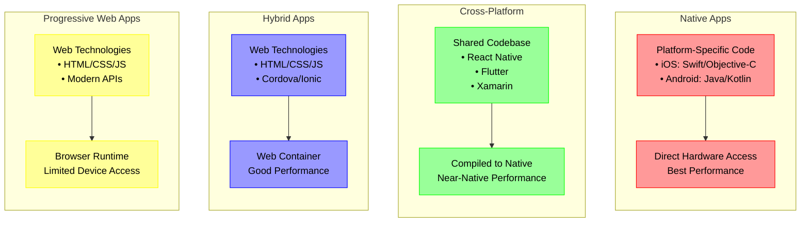

# Piscine Mobile

## Mobile

- [AWS - Mobile App Dev](https://aws.amazon.com/mobile/mobile-application-development/)
- [IBM - Mobile App Dev](https://www.ibm.com/think/topics/mobile-application-development)

There are 4 main ways to develop mobile applications:



Breakdown of Each Approach:

- Native Applications
  - Written specifically for each platform
  - Best performance and direct hardware access
  - Requires separate codebases for iOS and Android
  - Higher initial investment but optimal results
- Cross-Platform Development
  - Single codebase for multiple platforms
  - Popular frameworks include Flutter and Xamarin
  - Better resource utilization compared to hybrid apps
  - Ideal for complex applications needing native performance
- Hybrid Applications
  - Built using web technologies (HTML/CSS/JavaScript)
  - Runs in a web container with native bridge
  - Easier to maintain but may have performance limitations
  - Good for simpler applications or web-first experiences
- Progressive Web Apps (PWAs)
  - Web applications with app-like features
  - No installation required
  - Works across devices through browsers
  - Limited access to device hardware

### Mobile Development Environment

#### Front-end Components

- Visual and interactive parts users experience directly
- Resides on the device or accessible through browser
- Focuses on user interface and experience

#### Back-end Services

- Handles data processing and storage
- Manages API connections
- Provides cloud services integration

### Key Considerations for Mobile Development

#### Resource Management

- Mobile devices have limited processing power and memory
- Apps must be optimized for performance
- Consider offloading heavy processing to cloud services

#### User Experience

- Design for touch interfaces
- Keep navigation simple and intuitive
- Optimize for mobile screen sizes

#### Distribution

- App store requirements differ between platforms
- iOS requires $99/year developer program fee
- Android charges a one-time $25 registration fee

### Best Practices

#### Development Process

- Start with core features and expand gradually
- Test thoroughly on multiple devices
- Consider platform-specific optimizations

#### Performance Optimization

- Use cloud services for heavy processing
- Implement efficient data caching
- Optimize resource usage

#### Security

- Implement proper authentication
- Secure data transmission
- Follow platform security guidelines

## Typescript

[Typescript](https://www.typescriptlang.org/docs/)
[Typescript - React Cheatsheets](https://github.com/typescript-cheatsheets/react)

## ADB

ADB stands for Android Debug Bridge, a versatile command-line tool that lets you communicate with an emulator instance or connected Android device. It is a client-server program that includes three components:

- A client, which runs on your development machine
- A daemon (adbd), which runs on the device
- A server, which manages communication between the client and the daemon
  The client sends commands to the server, which forwards them to the daemon running on the device. The daemon executes the commands and returns the results to the client.
  The ADB client can be used to perform various tasks, such as installing and debugging apps, copying files, and running shell commands on the device. The ADB server manages communication between the client and the daemon, ensuring that commands are executed correctly.

[Android Debug Bridge](https://developer.android.com/studio/command-line/adb)

## React Native

[React Native: Setup](https://reactnative.dev/docs/set-up-your-environment)
[ReactNative - recommandation for Expo](https://reactnative.dev/blog/2024/06/25/use-a-framework-to-build-react-native-apps)
[Expo: Template to Setup](https://docs.expo.dev/more/create-expo/#--template)

```bash
# Create a new Expo app with TypeScript template and blank file structure
npx create-expo-app --template blank-typescript
```

or

```bash
# Create a new Expo app with TypeScript template and file structure
npx create-expo-app@latest
```

with React Native CLI:

```bash
npx @react-native-community/cli@latest init project_name
```

### Requirements

- Node.js (LTS version recommended)
- Java Development Kit (JDK): https://adoptium.net/installation/linux/
- Android SDK: https://developer.android.com/studio/install

### Running

#### Running with emulator

[Android studio](https://docs.expo.dev/workflow/android-studio-emulator/)

#### Running on device (sudo needed)

[ReactNative - Running on Device](https://reactnative.dev/docs/running-on-device)

Setup adb and run the following commands:

```bash
# Show devices and start adb daemon if not running
adb devices
```

```bash
# (useful for debugging with Metro Bundler and React Native DevTools)
# This command allows the device to connect to the host machine on port 8081
adb reverse tcp:8081 tcp:8081
# and or
adb reverse tcp:8087 tcp:8087
```

Start the Expo server:

```bash
npx expo start
```

Start with React Native CLI (better adb - no error with debugger):

```bash
# JS build tool for ReactNative - Metro
npm start
```

```bash
# in another terminal
# Build and run the app
npm run android
```

### File structure

[ReactNative - Typescript](https://reactnative.dev/docs/typescript)

Medium Project Structure:

```tree
.
├── android
│   └── ...
├── ios
│   └── ...
├── App.tsx
├── app.json
├── assets
│   ├── icon.png
│   └── splash.png
├── components
│   ├── Buttons
│   │   ├── SquareButton.tsx
│   └── Cards
│       ├── Card.tsx
│       └── CardItem.tsx
├── constants
│   ├── Colors.ts
│   └── Layout.ts
├── hooks
│   ├── useFetch.ts
│   └── useTheme.ts
├── navigation
│   ├── AppNavigator.tsx
│   └── NavigationContainer.tsx
├── pages
│   ├── HomePage.tsx
│   ├── DetailsPage.tsx
│   └── SettingsPage.tsx
├── services
│   ├── api.ts
│   └── auth.ts
├── styles
│   ├── GlobalStyles.ts
│   └── Theme.ts
├── utils
│   ├── formatDate.ts
│   └── validateInput.ts
├── __tests__
│   ├── App.test.tsx
│   ├── components
│   │   ├── Buttons
│   │   │   ├── SquareButton.test.tsx
│   │   └── Cards
│   │       ├── Card.test.tsx
│   │       └── CardItem.test.tsx
│   └── ...
├── node_modules
│   └── ...
└── ...
```

Large project structure:

```tree
MyApp
├── modules
│   ├── accounts
│   │   ├── components
│   │   ├── pages
│   │   └── ...
│   ├── growth
│   │   ├── components
│   │   ├── pages
│   │   └── ...
│   └── shared
│       ├── components
│       ├── hooks
│       └── ...
└── App.js
```

### Layout

[ReactNative - Layout - FlexBox](https://reactnative.dev/docs/flexbox)
[ReactNative - Style](https://reactnative.dev/docs/style)

### Icons

[ReactNative - Icons](https://oblador.github.io/react-native-vector-icons/)

```bash
# Install react-native-vector-icons
npm install react-native-vector-icons
```

#### List of Icons

- [List of Icons](https://oblador.github.io/react-native-vector-icons/)
- [Material Design Icons](https://pictogrammers.com/library/mdi/)

### Gestures

[ReactNative - Gesture Handler](https://docs.swmansion.com/react-native-gesture-handler/docs/)
[Gesture Handler - States](https://docs.swmansion.com/react-native-gesture-handler/docs/fundamentals/states-events)

### React Native CLI

#### Metro Bundler

Metro is a JavaScript bundler for React Native applications. It is responsible for transforming and serving your JavaScript code, allowing you to run your app on Android and iOS devices.
Metro is designed to work with React Native and provides features like hot reloading, which allows you to see changes in your app without needing to rebuild it completely. It also handles the resolution of JavaScript modules and assets, ensuring that your app runs smoothly on different platforms.

#### Watchman

Watchman is a file-watching service developed by Facebook. It is used by Metro to monitor changes in your project files and trigger updates in the development environment. Watchman helps improve the performance of the development process by efficiently tracking file changes and notifying Metro when it needs to rebuild or reload the app.

#### Gradle

Gradle is a build automation tool used by Android Studio to compile and package Android applications. It is responsible for managing dependencies, building the app, and generating the final APK (Android Package) file that can be installed on Android devices.

#### Babel

Babel is a JavaScript compiler that allows you to use the latest JavaScript features in your React Native applications. It transforms modern JavaScript code into a version that is compatible with older devices and browsers, ensuring that your app runs smoothly across different platforms.

[Configuring Babel](https://babeljs.io/docs/config-files/)
[ReactNative - Babel](https://reactnative.dev/docs/babel)
